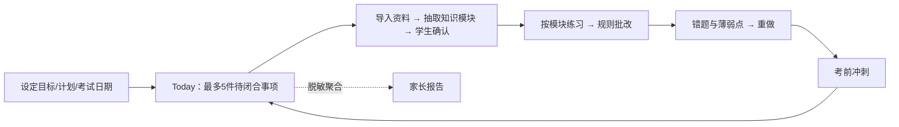

# 01 · 产品需求（PRD）

> 本文件只写"为什么、为谁、做什么、不做什么"。当前完成到哪里，以 [`capabilities.json`](capabilities.json) 为准，本文不复述状态。

## 0. 需求来源

本 PRD 的 S1–S7 产品语义以第一版 ai-studybuddy 的子系统 PRD 为准：

| 子系统 | 产品需求来源 |
|---|---|
| S1 学习节奏 | [`S1 StudyRhythm PRD`](archive/legacy-product-references/ai-studybuddy/subsystems/03-S1学习节奏子系统PRD-StudyRhythm.md) |
| S2 资料笔记 | [`S2 NoteBuilder PRD`](archive/legacy-product-references/ai-studybuddy/subsystems/03-S2-资料笔记子系统PRD-NoteBuilder.md) |
| S3 限时练习 | [`S3 PracticeRunner PRD`](archive/legacy-product-references/ai-studybuddy/subsystems/03-S3-限时练习子系统PRD-PracticeRunner.md) |
| S4 错题改错 | [`S4 ErrorFixer PRD`](archive/legacy-product-references/ai-studybuddy/subsystems/03-S4-错题改错子系统PRD-ErrorFixer.md) |
| S5 期末冲刺 | [`S5 ExamCrammer PRD`](archive/legacy-product-references/ai-studybuddy/subsystems/08-S5-期末冲刺子系统PRD-ExamCrammer.md) |
| S6 家长观察 | [`S6 ParentReport PRD`](archive/legacy-product-references/ai-studybuddy/subsystems/06-S6-家长观察子系统PRD-ParentReport.md) |
| S7 课堂采集 | [`S7 ClassCapture PRD`](archive/legacy-product-references/ai-studybuddy/subsystems/07-S7-课堂录音子系统PRD-ClassCapture.md) |

第二版 pi-studybuddy 只作为 TTS、备份恢复和通用对话等增量需求的参考。第一版 PRD 的产品目标、流程和边界不因当前实现缺口而改变；当前实现、验证、证据和缺口只读取 [`capabilities.json`](capabilities.json)。

## 1. 为何而生、为谁而做

**为何而生**：大学学习常见的问题不是没有资料，而是课程、考试目标、每天的节奏、资料整理、练习、错题复盘和考前冲刺彼此脱节。StudyBuddy 要把这些动作组织成一个学生能长期使用、**始终看得见下一步**的本机学习闭环。

**为谁而做**：

| 角色 | 定位 | 要的 | 不要的 |
|---|---|---|---|
| 学生 | 唯一操作者、数据拥有者 | 每天几件能完成的小事；AI 帮忙保证质量 | 被复杂管理压垮；被监控；被 AI 替代判断 |
| 家长 | 异步报告接收者，不登录 | 知道孩子是否保持正常节奏、考试临近 | 变成查岗工具；看到原文、答案或聊天 |
| 维护者 | 隐性运维 | 安装、配置 Provider/邮件、备份恢复 | 介入日常学习决策 |

**为什么本机、回环、分阶段**：学习数据默认留在本机，服务只监听 `127.0.0.1`，没有公网入口、远程家长面板或固定服务器成本。每个场景子系统按独立任务、计划和验收推进，避免"先堆功能、后补边界"。

## 2. 成功标准

成功不是"功能多"，而是"能真实陪一个学生持续使用"。

| 维度 | 验收标准 |
|---|---|
| 主闭环 | 目标/计划 → Today → 资料与知识模块 → 练习 → 错题 → 冲刺 → 回到 Today 并出现新的下一步，每一跳都有持久化事实 |
| 看得见下一步 | Today 任一时刻最多 5 项，每项有来源、有可点击的动作；完成后重算 |
| 本机可用 | 学生在自己的 Windows 电脑上用浏览器访问 `127.0.0.1:8787`；单进程、单实例 |
| AI 边界 | AI 只生成草稿；学生确认后才成为事实；日期、状态、评分、排序由规则决定 |
| 家长可见性 | 只收脱敏日报/周报/月报/考前提醒；不含资料原文、笔记、答案、错题正文 |
| 可恢复 | 备份、校验、恢复可在本机完成，不修复损坏数据 |

## 3. 主用户流程



每项闭合遵循：**系统建议 → 学生确认 → 学习或作答 → 质量检查 → 修正/错题回流 → 完成证据**。AI 不可用时，事项进入"待质检"，不阻塞学习。

## 4. 共同对象

```text
LearningGoal / StudyPlan / CramGoal(target_date)
Material → Extraction/TextSpan → KnowledgeModule（来源绑定，草稿→确认）
KnowledgeModule → Exercise → PracticeSession/Attempt → MistakeCase → WeakPoint
Plan + Event + Mistake → StudyReport（只做脱敏聚合）
```

`KnowledgeModule` 是资料、练习、错题、冲刺之间的共同语言。Today 只读这些对象，不自己产生事实。

## 5. 子系统

七个场景子系统，加三项横切能力。边界和依赖见 [`02-SUBSYSTEMS.md`](02-SUBSYSTEMS.md)，每个子系统一份文档放在 [`subsystems/`](subsystems/)。

## 6. AI 边界

- 不用 LLM：格式转换、OCR、ASR、客观题批改、日期与优先级计算、去重、统计。
- 用 LLM：知识模块抽取、笔记、出题/变题、主观题辅助评分、材料问答。
- 原则：所有生成内容先是带引用的草稿，不覆盖已确认的编辑；Provider 可替换、默认关闭、显式 opt-in；记录模型、耗时和失败原因，不记录密钥和学生原文。

## 7. 不做什么

- 不做 LMS、教务系统替代品、家长实时监控/定位/聊天审查。
- 不上云、不做多用户、不做共享 data_root、不做多 worker。
- 不做 pi/Electron 桌面壳与 pi 原生通用对话（已于 2026-10 退出主线，原文见 [`archive/legacy-product-references/`](archive/legacy-product-references/)）。
- 不要求七个子系统同时完成。

## 8. 优先级（2026-10-05 按初衷重排）

| 级别 | 内容 | 理由 |
|---|---|---|
| P0 | 主闭环：目标 → Today → 资料 → 练习 → 错题 → 冲刺 → Today 新下一步 | 直接对应"看得见下一步" |
| P1 | 家长报告固定周期与真实外发；Windows 实机 real-pass（启动、单实例、备份恢复） | 家长是初衷里写明的第二角色；"长期用"需要实机可靠 |
| P2 | 文档唯一事实源与结构化治理测试 | 防止漂移反复出现 |
| P3 | TTS 扩展、材料问答增强、S7、真实 OCR/ASR | 初衷未提及，延后不伤闭环 |
