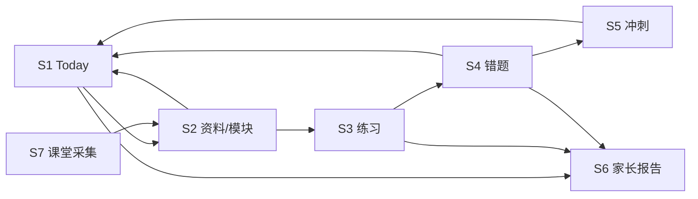

# 02 · 子系统地图

> 每个子系统一份文档，固定七节：目标、用户流程、数据对象、页面与 API、规则与 AI 边界、验收标准、已知缺口。状态以 [`capabilities.json`](capabilities.json) 为准。

## 1. 总表

| ID | 子系统 | 服务的场景 | 主要页面 | 文档 |
|---|---|---|---|---|
| S1 | 学习节奏 / Today | 今天该做什么 | `today.html` `plans.html` `plan-detail.html` | [S1](subsystems/S1-学习节奏-Today.md) |
| S2 | 资料笔记 | 资料变成可学的知识模块 | `materials.html` `material-detail.html` `notes.html` | [S2](subsystems/S2-资料笔记-NoteBuilder.md) |
| S3 | 限时练习 | 按模块练、规则批改 | `exercises.html` `practice.html` `practice-session.html` `practice-result.html` | [S3](subsystems/S3-限时练习-PracticeRunner.md) |
| S4 | 错题改错 | 错了能改、改对能关 | `review.html` | [S4](subsystems/S4-错题改错-ErrorFixer.md) |
| S5 | 期末冲刺 | 考前集中补弱 | `practice.html#cram-goals` | [S5](subsystems/S5-期末冲刺-ExamCrammer.md) |
| S6 | 家长报告 | 家长放心、不越界 | `reports.html` `parent.html` | [S6](subsystems/S6-家长报告-ParentReport.md) |
| S7 | 课堂采集 | 课堂录音变成资料 | `capture.html` `classroom.html` | [S7](subsystems/S7-课堂采集-ClassCapture.md) |
| X | 材料问答 / 朗读 / 备份恢复 | 横切能力 | `qa.html`、知识模块朗读、CLI | [X](subsystems/X-横切能力.md) |

## 2. 依赖与回流

**回流规则**：下游产生的每个事实（草稿模块、错题、薄弱点、冲刺临近、练习进度）都必须能被 Today 读到，并给出一个指向正确页面的动作。只要有一跳读不到，"看得见下一步"就断了。

## 3. 开发顺序

1. 先补主闭环断点（P0），每补一跳加一条跨子系统测试。
2. 再做 S6 固定周期报告与 Windows 实机验收（P1）。
3. 横切能力与 S7 增强延后（P3）。

## 4. 防止再次变乱

- 新能力先在 `capabilities.json` 登记，再写子系统文档，再写代码。
- 子系统文档不写测试通过数、日期流水账；这些写进验证证据目录。
- 历史文档只进 `archive/`，不在当前文档里复述。
